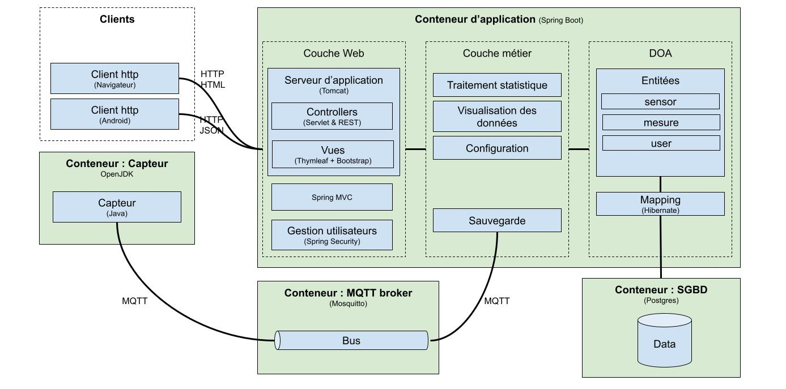
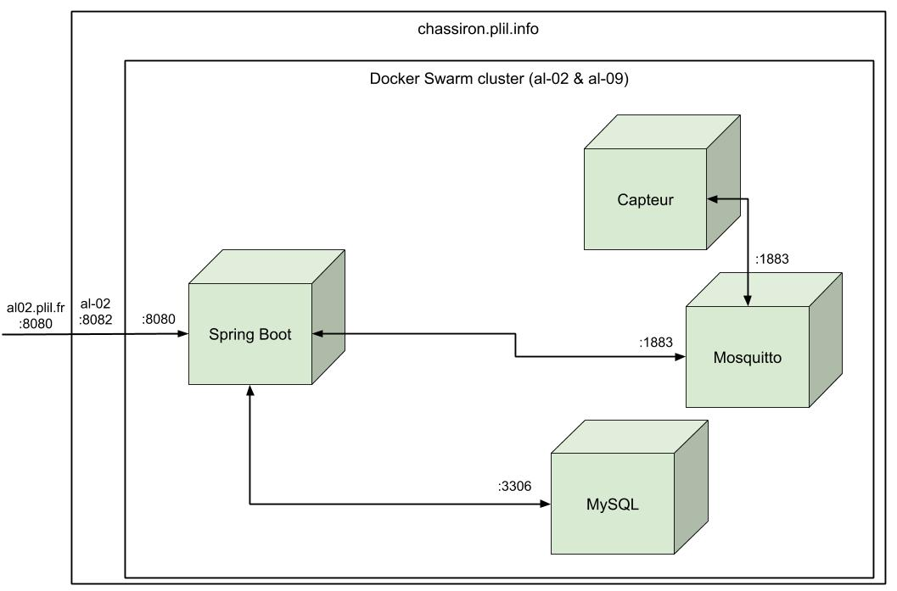
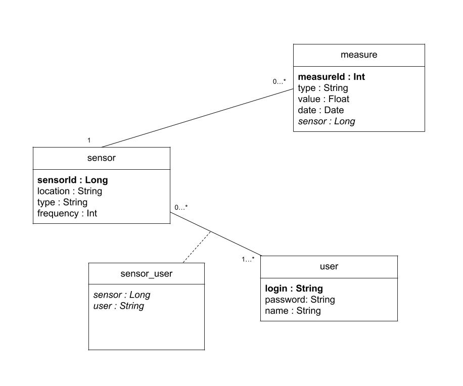

# Architecture logicielle 2020/2021, groupe 2:

## Equipage:
- Vincent Dubois (chef de projet)
- Lukas Fauchois
- Evan Gury
- Richard Simonin

## Architecture

### Architecture générale

### Architecture de la base de donné

## Répartition des taches et gestion de projet
[Trello](https://trello.com/b/qCbSFUoS/al-grp2)

## Déploiement (local)

### Prérequis (sur les deux VMs)
* Installation de Docker
* Installation de Docker-compose

### Construction des images a partir du code source
./container.sh

### Déploiement
docker-compose up

Le site est accéssible depuis http://localhost:8082

## Déploiement (sur chassiron)

### Prérequis (sur les deux VMs)
* Installation de Docker
* Installation de Docker-compose
* Création du cluster docker Swarm

### Construction des images a partir du code source
./container.sh

### Déploiement (sur al-02 uniquement)
./deploy.sh

Le site est accéssible depuis http://al02.plil.fr